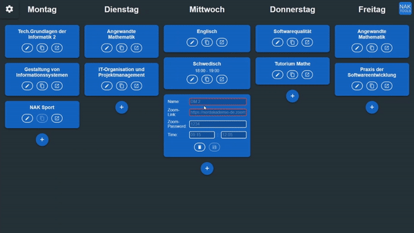

# Zoom Calendar

[](https://nak.coderesting.dev/)

This is a calendar for students with online lectures in Zoom. You can quickly copy meeting passwords to the clipboard and join.

## Usage

Just visit https://nak.coderesting.dev/zoomcalendar/
[](https://nak.coderesting.dev/zoomcalendar/)

### Edit subjects

Every subject is in the edit mode after its creation. From here you can

1. Add a name, link, password or time to a subject
2. Save or delete a subject.

### Display mode

After a subject is saved, it goes into display mode. From here you can

1. Drag a subject to reorder your schedule
2. Go into edit mode
3. Copy the Zoom password into the clipboard
4. Launch the Zoom meeting (You can skip option 3 when using this action because it also copies the password)

### Settings

<!-- prettier-ignore -->
| App setting            | Explanation|
| ---------------------- | ---------------------- |
| Close join tab after | The browser will open a new tab when you join a meeting. This option will close this tab for you after x seconds. When this number is too low you might not join the meeting.|
| Dark theme           | Self explanatory |
| Show satuday           | Self explanatory |
| Sort schedule        | This option sorts your subjects according to your real schedule. It is very important that you name your subjects exactly like the ones in your real schedule. |

<!-- prettier-ignore -->
| Sync setting            | Explanation|
| ---------------------- | ---------------------- |
| Account       | Sync your schedule with all your devices |
| Import/Export        | Share your schedule with your fellow students or create backups |

## Contribute

Feel free to submit pull requests, open new issues or just spread the word about this [NAK Tool](https://nak.coderesting.dev/).

### Project setup

```
npm install
```

### Compiles and hot-reloads for development

```
npm run serve
```

### Compiles and minifies for production

```
npm run build
```

### Lints and fixes files

```
npm run lint
```
