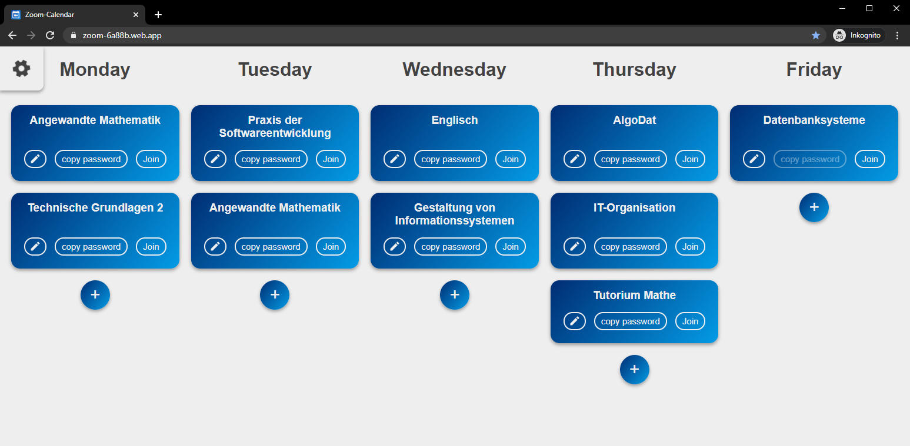

# Zoom Calendar

This is a calendar for students with online lectures in Zoom. You can quickly copy meeting passwords to the clipboard and join.

## Usage

You don't need the Repo to use the Calendar. Just visit https://zoom-6a88b.web.app/
[](https://zoom-6a88b.web.app/)

## Contribute

Feel free to contribute and create pull requests.

### Project setup

```
npm install
```

### Compiles and hot-reloads for development

```
npm run serve
```

### Compiles and minifies for production

```
npm run build
```

### Lints and fixes files

```
npm run lint
```
